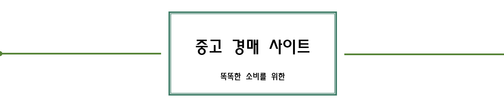
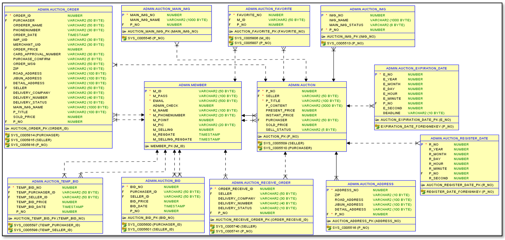
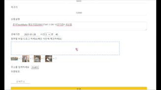

1. # 개요💡
   __옥션 중고 장터를 롤 모델로 구성한 프로젝트입니다.__  
   : 예전부터 옥션 중고 장터의 시간이 카운트 되는 기능과 옥션의 경매 방식에 흥미를 가지고 있었고 꼭 한번은 만들고 싶다는 생각을 하고 있었습니다. 그러던 중 팀 프로젝트 주제로 중고 사이트가 선정되었고, 경매 부분만 따로 제가 맡게 되었습니다. 백엔드, 프론트엔드, 테이블 설계까지 개인 프로젝트의 개념으로 진행하게 되었습니다.

프로젝트 기간 : 1개월   
개발 인원 : 1명   
   
   
   
   
   
   
   
   
   

1. # 데모 영상
   

1. # 테이블 설계📲
   

1. # 주요 기능🔍
   __1) 메인화면 : 각 상품 별로 마감 시간 카운트__   
    
       
    
   

   현재 시간과 마감 시간의 차이를 계산한 후 setTimeout으로 초를 1씩 뺍니다. 
   초가 0이 되면 분에서 값을 가져옵니다. 
   분이 0이면 시간에서 값을 가져옵니다. 
   시간이 0이면 일에서 값을 가져옵니다. 이런 식으로 년까지 계산을 합니다. 
   단, 달의 경우 윤달이 있기 때문에 경매의 마감날짜 차이를 1달을 넘기지 않습니다. 
   2월 28일날 등록을 했고 3월 4일이 마감일이면 월에 해당하는 일 수를 가져올 때 마감일의 전달 일 수를 가져오면 됩니다.  
   이 함수가 new Date(nowYear, nowMonth - 1, 0).getDate()입니다. 
   

   
    
    
   
   __2) 이미지 추가 : 상품 등록시 이미지를 드래그해서 추가__   
    
       
    
   파일을 드래그 드롭을 하게 되면 e.originalEvent.dataTransfer.files[0] 코드를 통해 추가된 파일 정보를 가져와 비동기 방식으로 서버에 파일을 전송합니다.
   서버에서 이미지 파일이 맞으면 로컬의 하드디스크에 저장합니다. 클라이언트 쪽에서 받은 데이터가 success이면 img태그에 방금 로컬에 저장된 이미지 파일을
   출력합니다. 이미지 파일 이름 중복을 막기 위해 UUID 클래스를 사용합니다.   
    
    
      
   __3) 남은 시간 추가 : 사용자가 입찰 할 경우__   
    
      
    
   현재 남은 시간을 가져와 00:00:00의 시간 형태에서 : 를 기준으로 3개의 배열로 split 후 가운데 값에 2을 더합니다.
    
    
   
   __4) 결제 시스템 구현__
       
   
    
   결제 시스템은 아이엠포트 api를 이용했습니다.
    
    

1. # 프로그램 설계
    

1. # 기술 스택
    
   
    

       
  
    
    클라이언트 html css js jquery jsp
    서버 java mybatis
    oracle
    프레임워크 java spring, bootstrap
    cloud AWS
    tools  Eclipse, git
1. # DataFlow
 
 

