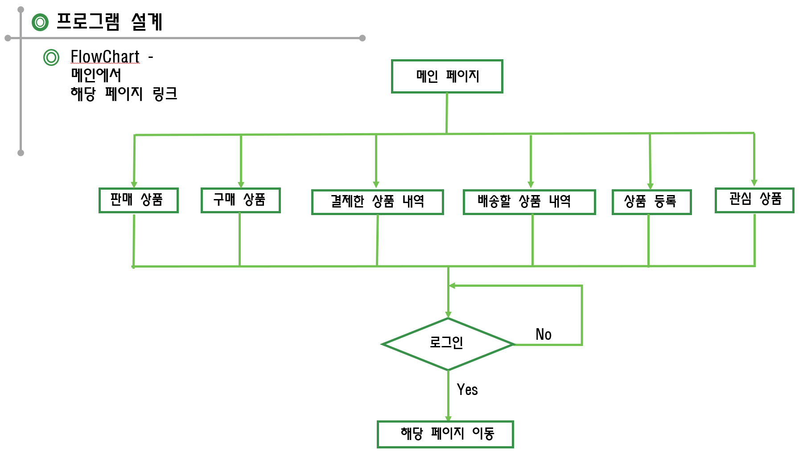

1. # 개요💡
   __옥션 중고 장터를 롤 모델로 구성한 프로젝트입니다.__  
   : 예전부터 옥션 중고 장터의 시간이 카운트 되는 기능과 옥션의 경매 방식에 흥미를 가지고 있었고 꼭 한번은 만들고 싶다는 생각을 하고 있었습니다. 그러던 중 팀 프로젝트 주제로 중고 사이트가 선정되었고, 경매 부분만 따로 제가 맡게 되었습니다. 백엔드, 프론트엔드, 테이블 설계까지 개인 프로젝트의 개념으로 진행하게 되었습니다.   
   
   
   
   
   
   
   
   
   

1. # 테이블 설계📲
   

1. # 주요 기능🔍
   1) 메인화면 : 각 상품 별로 마감 시간이 카운트됩니다.   
   
       

    
    
      
   2) 이미지 추가 : 상품 등록시 이미지를 드래그 해서 추가합니다.   
       
   
    
    
      
   3) 남은 시간 추가 : 사용자가 입찰을 할 경우   
      
      
   
    
    
      
   4) 입찰 종료 : 시간이 만료되면 진행 창이 나타나면서 현재화면은 비활성화 됩니다.   
      

    
    
   
   5) 결제 api를 이용하여 제 통장에서 돈이 빠져나가고 다음날 다시 들오게 됩니다.   
      
   
1. # 프로그램 설계
    
       
   
 

